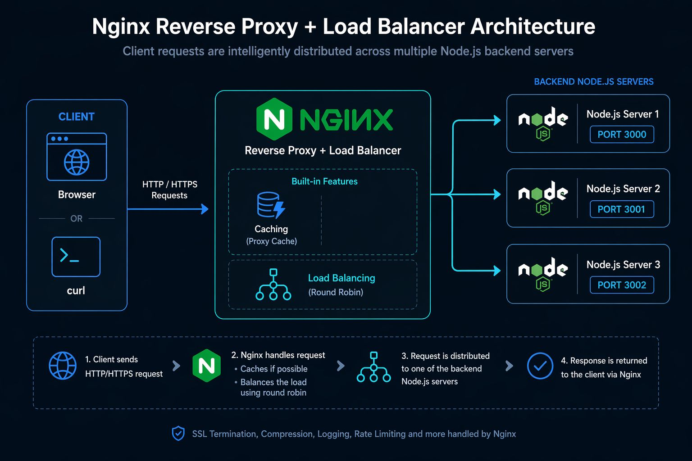

# Nginx Load Balancer + Node.js Backend + Caching System

## Overview

<p align="center">
  <br/>
</p>

This project demonstrates a production-style backend architecture using **Nginx as a reverse proxy, load balancer, and caching layer**, distributing traffic across multiple Node.js servers.

It simulates how real-world scalable backend systems handle high traffic efficiently.

---

## Architecture

```
Client (Browser / CURL)
        ↓
Nginx (Load Balancer + Cache Layer)
        ↓
-----------------------------------
|     Node Server 1 (3000)        |
|     Node Server 2 (3001)        |
|     Node Server 3 (3002)        |
-----------------------------------
```

---

## Features

* Reverse proxy using Nginx
* Round-robin load balancing
* Multiple Node.js backend servers
* Response caching (performance optimization)
* Cache hit/miss tracking headers
* Scalable architecture design

---

## Technologies Used

* Node.js
* Nginx
* Express.js
* Linux (Ubuntu VM)

---

## How It Works

1. Client sends request to `/api/data`
2. Nginx receives the request
3. Nginx checks cache:

   * If cached → returns response instantly
   * If not cached → forwards request to backend
4. Nginx distributes traffic across multiple Node servers (load balancing)
5. Response is returned to client

---

## Setup Instructions

### 1. Clone Repository

```bash
git clone <your-repo-url>
cd nginx-node-loadbalancer
```

---

### 2. Install Dependencies

```bash
npm install
```

---

### 3. Start Backend Servers

Run each server in separate terminals:

```bash
node server1.js
node server2.js
node server3.js
```

---

### 4. Configure Nginx

Edit:

```bash
/etc/nginx/sites-enabled/default
```

---

### Load Balancer + Cache Config

```nginx
upstream backend_servers {
    server 127.0.0.1:3000;
    server 127.0.0.1:3001;
    server 127.0.0.1:3002;
}

server {
    listen 80;
    server_name localhost;

    location /api/ {

        proxy_pass http://backend_servers;

        proxy_set_header Host $host;
        proxy_set_header X-Real-IP $remote_addr;

        # Cache configuration
        proxy_cache my_cache;
        proxy_cache_methods GET;
        proxy_cache_valid 200 10s;

        add_header X-Cache-Status $upstream_cache_status;
    }
}
```

---

### 5. Define Cache Zone (nginx.conf)

Inside `http {}` block:

```nginx
proxy_cache_path /tmp/nginx_cache
    levels=1:2
    keys_zone=my_cache:10m
    max_size=100m
    inactive=60m
    use_temp_path=off;
```

---

### 6. Restart Nginx

```bash
sudo nginx -t
sudo systemctl restart nginx
```

---

## API Endpoint

### GET `/api/data`

Returns:

```json
{
  "server": "Server 1/2/3",
  "time": "2026-04-24T..."
}
```

---

## Testing

### Direct backend test:

```bash
curl http://localhost:3000/api/data
```

### Through Nginx:

```bash
curl -i http://localhost/api/data
```

Check headers:

* `X-Cache-Status: MISS` (first request)
* `X-Cache-Status: HIT` (cached response)

---

## Learning Outcomes

* Reverse proxy architecture
* Load balancing techniques
* Cache optimization strategies
* Multi-server backend design
* Nginx configuration management

---

## Common Issues

### 1. 404 from Nginx

* Ensure proxy_pass is correctly configured
* Ensure Node servers are running

### 2. Cache not working

* Check `proxy_cache_path` exists in `nginx.conf`
* Restart Nginx after changes

### 3. Connection refused

* Backend server not running on port

---

## Future Improvements

* Docker-based deployment
* HTTPS (SSL/TLS)
* Auto-scaling simulation
* Redis distributed cache
* Kubernetes deployment

---

## Author

Built as a backend infrastructure learning project focusing on real-world system design using Nginx and Node.js.

